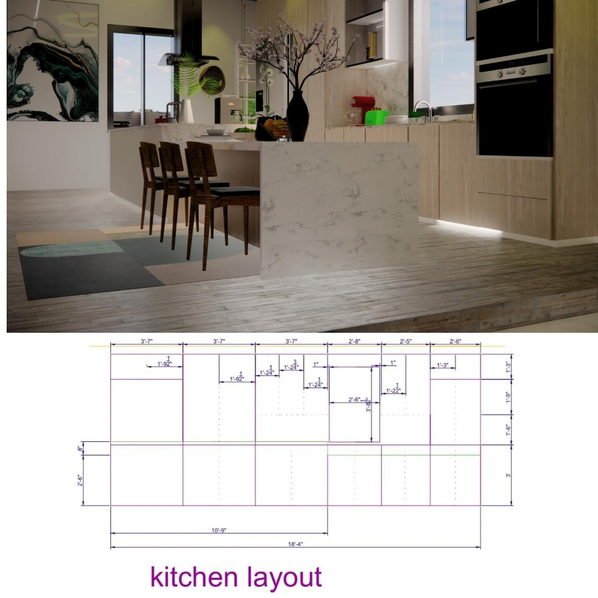
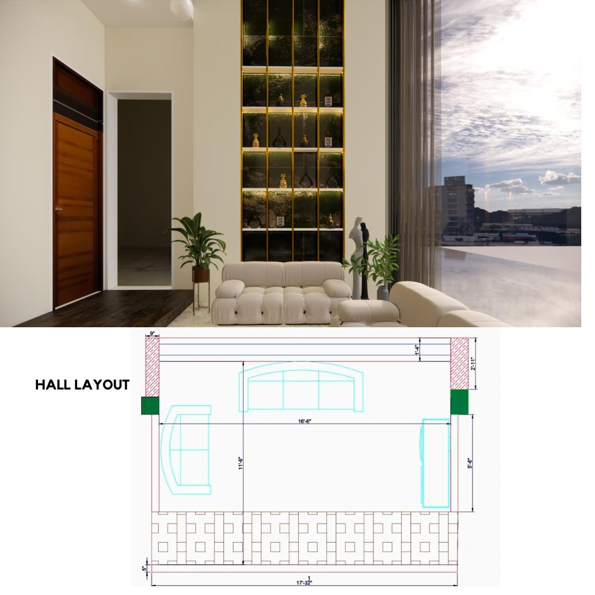
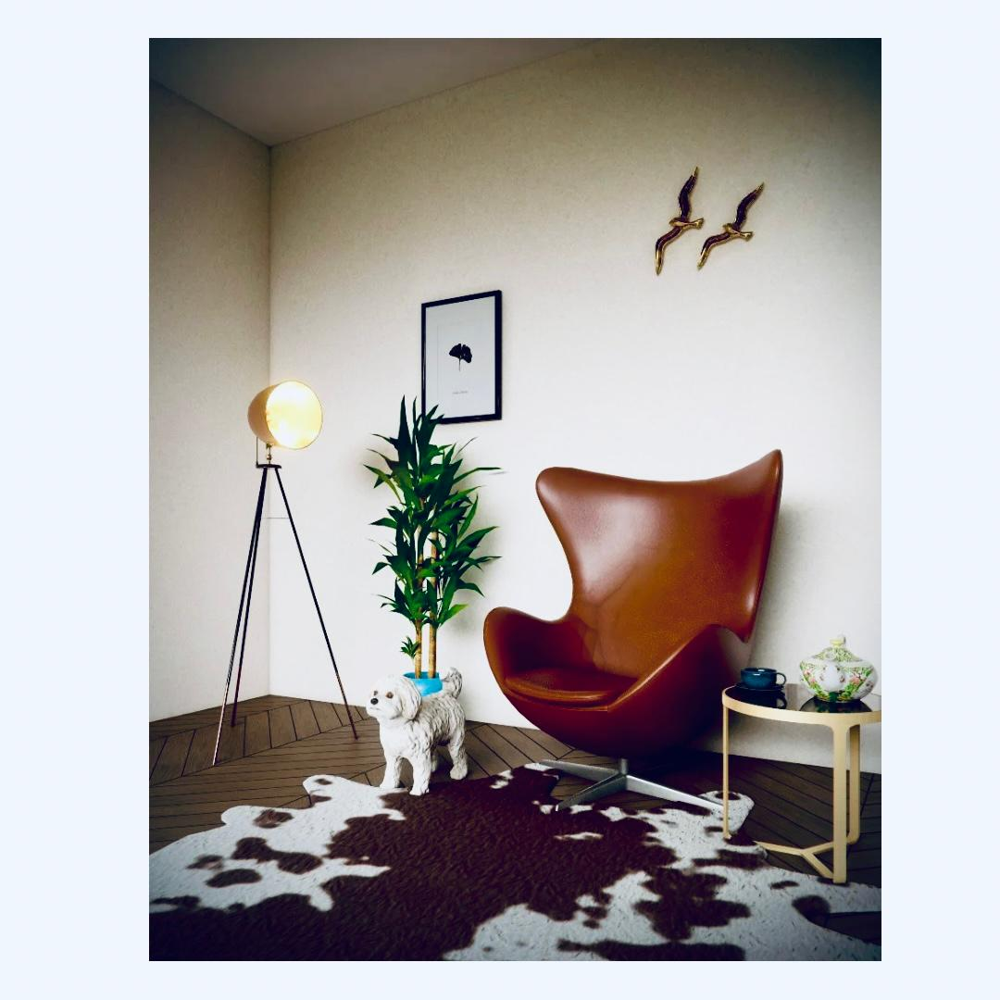
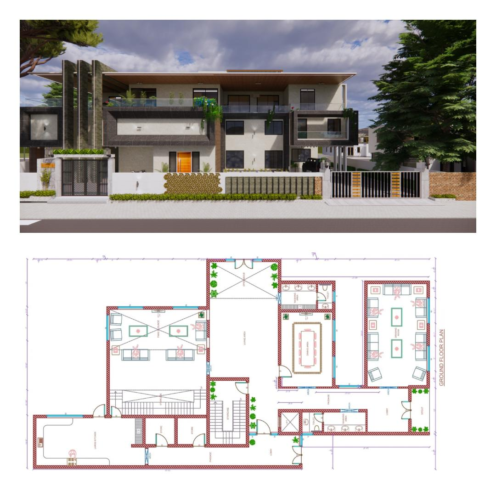
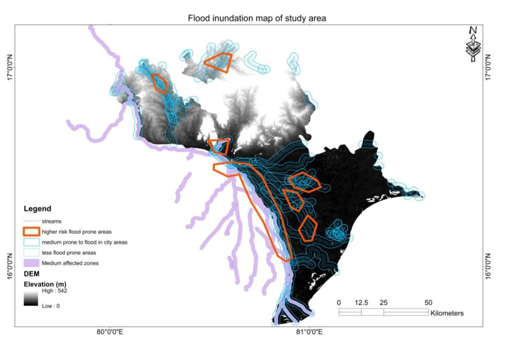
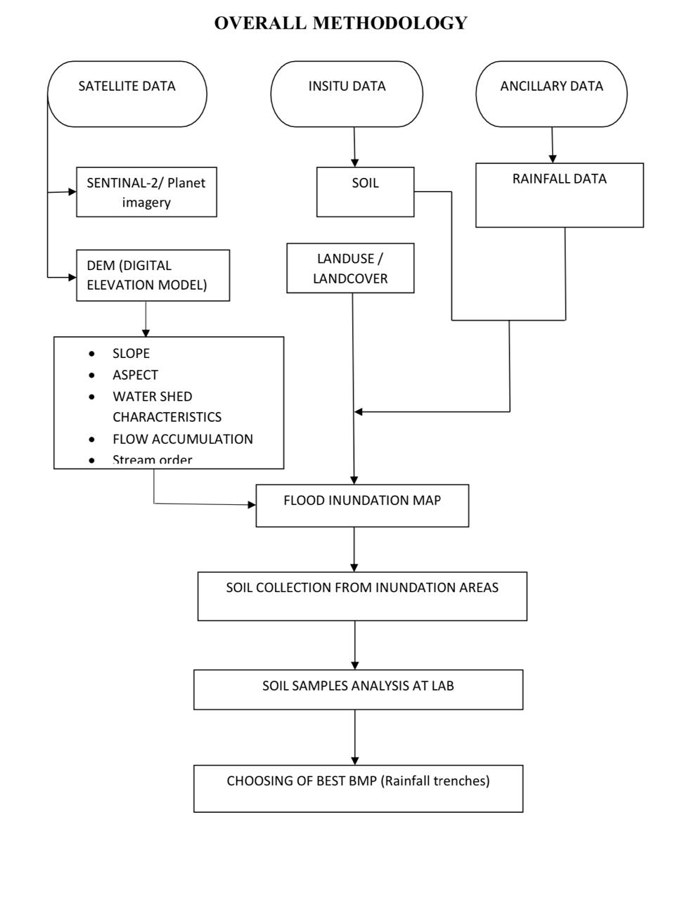

## 📍India
✉️ [Email: kranthikumarnalla@outlook.com](mailto:kranthikumarnalla@outlook.com)

🔗 [LinkedIn: kranthi kumar Nalla](https://www.linkedin.com/in/kranthi-kumar-nalla-7615801b2//
)  👨‍💻 [GitHub:kranthi kumar nalla](https://github.com/kranthikumarnalla)

## 🗂️ Projects
# [**Residential_project_A**](https://github.com/kranthikumarnalla/Residential_project_A)

 It  was a full interior design for a clients single detached home
 
**Tech Stack:** Autocad 2d, Sketchup 3d, vrey, Enscape, Photoshop

### BRIEF
 
Project- House design

Area-1724 sq.feet plot, 

location-vijayawada.

Combines modern design with functional spaces. It features three bedrooms, a hall, a kitchen, and a family lounge, all optimized for comfort.

Key Features:
- *Double-Height Living Room* with framed projections for added space and visual interest.
- *Sloping Translucent Ceiling* to diffuse natural light and create a serene atmosphere.
- *Bedroom Layout* designed for privacy and optimal light and ventilation.
- *Hall & Lounge* offer open, interconnected spaces for family interactions.
- *Ergonomic Kitchen* efficiently located near the living areas.

Advanced 3D modeling tools (SketchUp, V-Ray, Enscape) ensured precise design and presentation. The project blends aesthetic appeal with practical living, enhancing residential quality.

# [**Condominium_project_B**](https://github.com/kranthikumarnalla/Condominium_project_B)

### SPACE DESIGN 

I enjoy the challenge of transformation a space into something fresh and engaging

**Tech Stack:** Sketchup 3d,Enscape, Photoshop

 
### BRIEF
 
 Engaging the Concept of Space Design in Interior Design

- Interior design is about crafting experiences, not just arranging furniture. In my recent project, dark accents anchored the design, adding elegance and mystery without overwhelming the space. These tones 
  highlighted textures and created a dynamic balance between light and shadow, offering both calm and sophistication.

- Balance is key in design—how elements interact and align with functionality. Subtle contrasts, like soft lighting against dark hues, elevated the space and created a captivating atmosphere.

- Using tools like SketchUp, V-Ray, and Enscape, I brought this vision to life with realistic renderings that showcased the interplay of textures, light, and shadow.
  Ultimately, space design is a dialogue between form, function, and feeling, with dark accents serving as a timeless expression.

# [**Residential_project_C**](https://github.com/kranthikumarnalla/Residential_project_C)

 Full exterior design of a client single detached home
 
**Tech Stack:** Autocad 2d, Sketchup 3d, vrey, Enscape, Photoshop

### CONCEPT
An exterior design with a theme of contemporary and dark accents.
 
###   BRIEF 
 
Project- House exterior design,

Area-4356 sq. feet plot,

Location-Hyderabad. 

 - *Architectural Style*: Modern minimalism with clean lines, geometric forms, and open spaces.  
- *Facade Composition*:  
  - *Materials*: Dark cladding (charcoal-painted wood or metal), expansive glass windows, and polished concrete accents.  
  - *Color Scheme*: Neutral base (white/gray) with contrasting dark tones (charcoal/black) for depth.  
- *Structural Features*:  
  - Sloping translucent ceiling diffuses natural light.  
  - Asymmetrical layout adds dynamism and visual interest.  
- *Fenestration*:  
  - Floor-to-ceiling windows maximize natural light and views.  
  - Minimalist, slim window frames maintain sleek appearance.  
- *Entryway Design*: Custom entry door with natural wood or metal finishes as a focal point.  
- *Lighting*:  
  - Concealed fixtures within overhangs for subtle illumination.  
  - Accent lighting highlights textures like stone and wood.  
- *Sustainable Elements*:  
  - Energy-efficient glazing.  
  - Rainwater harvesting systems.  
  - Optional green facade with vertical gardens.  
- *Landscaping*: Minimalist plantings with native or drought-tolerant species, and durable hardscape materials.

 
# [**Bachelores_project_D**](https://github.com/kranthikumarnalla/Bachelors_project_D)

**Tech Stack:** Remote sensing(RS),Geographic information system (GIS)

## APPLICATIONS OF REMOTE SENSING AND BEST MANAGEMENT PRACTISE METHODSFOR FLOOD CONTROL MANAGEMENT IN FLOOD PRONE AREAS OF VIJAYAWADA

Flow direction in study area:

### Abstract:

A flood is an overflow of water that submerges land when severe rainfall occurs.The flooding may occur as an over flow of water by heavy rainfall/snow storms/ water bodies such as rivers or lakes in which the water overtops and may result in some of that water escaping its usual boundaries. Floods cause severe damage to the infrastructure and human beings, if they occur in upslope areas and as catastrophic events. Some floods develop slowly, while others can occur in just 
a few minutes. Additionally, floods can be local, imparting a neighborhood or community, or very large, affecting entire river basin. However, the most affected areas by the floods are urban areas because of rapid urbanization. Floods in the urban areas can be controlled by using the best management practices (BMP’S), since they are highly effective and economic approaches to control the damages occurring by floods in urban areas. Hence a study is carried in Vijayawada,which is a major town of Andhra Pradesh after bifurcation. For the same, we utilized remote sensing and GIS datasets to find out the inundation zones and thus explored the suitable BMP’S to mitigate the flood. Among all the methods, the with moderate porosity characteristics are highly recommended for this region to avoid the floods

### Overall methodology:

### Result:

By considering the 5 available BMP’s, we are choosing RAIN BARRELS because the soil type is clay which takes long time to penetrate the water itself by which we can’t reduce the flood rate. Bio Retention type BMP is used in the fields and to construct the Infiltration Trenches, the place is not sufficiently available. Vegetated roofs are in practice in day to day life but not enough efficient to control the flood. Finally based on the based on the Soil condition, Density of Population, Land use / Land Cover Data,Type of Rain Fall, Climate, Amount of Rain Fall, Availability of land RAIN BARRELS is choosed as the best suitable BMP for that area.

## 🎓 Education

### B.TECH. Civil Engineering| Jawaharlal Nehru Technological University | India | Aug 2016 – May 2020
**Focus:** Building Planning & Control, Operations & Research, Industrial Engineering Management

