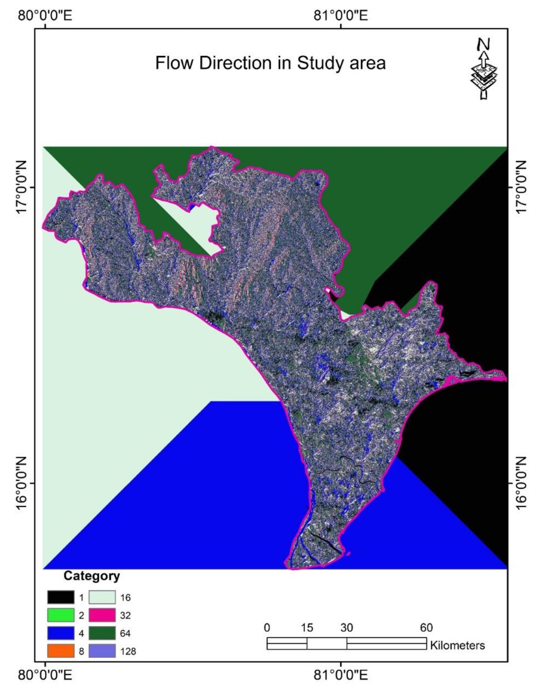

## 📍India
✉️ [Email: kranthikumarnalla@outlook.com](mailto:kranthikumarnalla@outlook.com)

🔗 [LinkedIn: kranthi kumar Nalla](https://www.linkedin.com/in/kranthi-kumar-nalla-7615801b2//
)  👨‍💻 [GitHub:kranthi kumar nalla](https://github.com/kranthikumarnalla)

## 🗂️ Projects
[**Residential_project_A**](https://github.com/kranthikumarnalla/Residential_project_A)

 It  was a full interior design for a clients single detached home
 
**Tech Stack:** Autocad 2d, Sketchup 3d, vrey, Enscape, Photoshop

 # BRIEF
 
Project- House design

Area-288 sq. m plot, 

location-vijayawada.

This project is exemplifies modern elegance and functionality. The layout includes three bedrooms, a hall, a kitchen, and a family lounge, all designed for optimal space utilization and comfort.

Architectural Features:

• Double-Height Living Room with Framed Projections: The elevated ceiling enhances spatial perception, while framed projections add depth and sophistication to the façade.

• Sloping Translucent Ceiling: This design element diffuses natural light, creating a serene ambiance and reducing the need for artificial lighting.

Interior Layout:

• Bedrooms: Each room is positioned to maximize natural light and ventilation, ensuring privacy and relaxation.

• Hall and Family Lounge: These interconnected spaces promote a harmonious environment for family interactions.

• Kitchen: Ergonomically designed for efficiency, the kitchen serves as a functional hub adjacent to the living areas.

Design Approach:

• The combination of vertical expansiveness and controlled natural lighting reflects a commitment to creating aesthetically pleasing and practical living spaces. Advanced 3D visualization tools, such as SketchUp for modeling and V-Ray and Enscape for rendering, were utilized to ensure precision in design execution and presentation.

This project stands as a testament to thoughtful architectural design, where form and function converge to enhance residential living quality.

[**Condominium_project_B**](https://github.com/kranthikumarnalla/Condominium_project_B)

# SPACE DESIGN 

 I enjoy the challenge of transformation a space into something fresh and engaging

 
**Tech Stack:** Sketchup 3d,Enscape, Photoshop

 
# BRIFE
 
 Engaging the Concept of Space Design in Interior Design

• Interior design is about crafting an experience, not just arranging furniture or choosing colors. In my recent project, I transformed the space by using dark accents to anchor the concept.

• Dark tones, symbolizing elegance and mystery, served as the foundation without overpowering the space. They highlighted textures and shapes, creating a dynamic interaction between light and shadow. This balance enriched the atmosphere, offering both calm and sophistication.

• Balance in design is crucial—how elements interact, and how aesthetics align with functionality. Subtle contrasts, like soft lighting against dark hues or vibrant décor against deep backdrops, elevated the space into a captivating experience.

• This project reinforced the idea that design is storytelling. The dark accents conveyed boldness and refinement, while every detail was chosen to inspire curiosity and personal connection.

• To bring the vision to life, I used SketchUp for 3D visualization and rendering in V-Ray, as well as Enscape. These tools allowed for detailed, realistic renderings that conveyed the intricate interplay of textures, light, and shadow, helping to visualize the experience before it was fully realized in the space.

Ultimately, space design is an ongoing dialogue—between form and function, and what’s seen and felt. In this conversation, dark accents convey a timeless expression.

[**Residential_project_C**](https://github.com/kranthikumarnalla/Residential_project_C)

 Full exterior design of a client single detached home
 
**Tech Stack:** Autocad 2d, Sketchup 3d, vrey, Enscape, Photoshop

 #  CONCEPT
 An exterior design with a theme of contemporary and dark accents.

  
  
 #   BRIEF 
 
Project- House exterior design,

Area-400 sq.m plot,

Location-Hyderabad. 

Designing a contemporary residential exterior with dark accents and a sloping translucent ceiling involves a harmonious blend of modern aesthetics and functionality. 

Here's a concise overview:

Architectural Style:

 • Modern Minimalism: Characterized by clean lines, geometric forms, and open spaces, this style emphasizes the seamless integration of indoor and outdoor areas.
 
Facade Composition:

Materials:

• Dark Cladding: Materials like charcoal-painted wood or dark metal panels provide a sophisticated look.

• Glass Elements: Expansive glass windows and doors enhance natural light and offer unobstructed views.

• Concrete Accents: Polished concrete pathways and retaining walls add texture and contrast.

Color Scheme:

• A neutral base palette, such as shades of white or gray, serves as the primary color.
• Contrasting darker tones, like charcoal or black, are applied to specific architectural features to create depth and emphasis.

Structural Features:

• Sloping Translucent Ceiling: A gently sloping roof with translucent panels diffuses natural light, creating a bright and airy interior atmosphere.

• Asymmetrical Layout: An asymmetrical arrangement of windows and structural elements introduces dynamism and visual intrigue.

Fenestration:

• Floor-to-Ceiling Windows: Large glass panels are strategically placed to maximize natural light and offer unobstructed views.

• Minimalist Frames: Slim, unobtrusive window frames maintain the sleek appearance and do not detract from the overall design.

Entryway Design:

• Entry Statement Door: A custom-designed door, possibly featuring natural wood or metal finishes, serves as a focal point and reflects the home's contemporary style.
Lighting:

• Concealed Fixtures: Integrated lighting within overhangs or architectural niches ensures the facade is illuminated subtly, highlighting key features without overwhelming the design.

• Accent Lighting: Strategically placed lights accentuate textures and materials, such as stone or wood cladding, enhancing the facade's depth and character during evening hours.

Sustainable Elements:

• Green Facade Options: Incorporating vertical gardens or green walls can enhance the building's sustainability and aesthetic appeal.

• Energy-Efficient Glazing: Utilizing high-performance glass improves thermal efficiency, reducing energy consumption for heating and cooling.

• Rainwater Harvesting Systems: Integrating systems to collect and reuse rainwater supports sustainable living practices.

Landscaping:

• Minimalist Plantings: The surrounding landscape features a selection of native or drought-tolerant plants arranged in a minimalist fashion, complementing the home's modern aesthetic while ensuring low maintenance.

• Hardscape Elements: Incorporating materials like concrete or stone in pathways and driveways aligns with the contemporary design language and provides durability.

This design harmoniously combines modern architectural principles with functional elements, creating a residence that is both visually striking and attuned to contemporary living needs.

 
[**Bachelores_project_D**](https://github.com/kranthikumarnalla/Bachelors_project_D)

**Tech Stack:** Remote sensing(RS),Geographic information system (GIS)

# APPLICATIONS OF REMOTE SENSING AND BEST MANAGEMENT PRACTISE METHODSFOR FLOOD CONTROL MANAGEMENT IN FLOOD PRONE AREAS OF VIJAYAWADA

Flow direction in study area:

Abstract:

A flood is an overflow of water that submerges land when severe rainfall occurs.The flooding may occur as an over flow of water by heavy rainfall/snow storms/ water bodies such as rivers or lakes in which the water overtops and may result in some of that water escaping its usual boundaries. Floods cause severe damage to the infrastructure and human beings, if they occur in upslope areas and as catastrophic events. Some floods develop slowly, while others can occur in just 
a few minutes. Additionally, floods can be local, imparting a neighborhood or community, or very large, affecting entire river basin. However, the most affected areas by the floods are urban areas because of rapid urbanization. Floods in the urban areas can be controlled by using the best management practices (BMP’S), since they are highly effective and economic approaches to control the damages occurring by floods in urban areas. Hence a study is carried in Vijayawada,which is a major town of Andhra Pradesh after bifurcation. For the same, we utilized remote sensing and GIS datasets to find out the inundation zones and thus explored the suitable BMP’S to mitigate the flood. Among all the methods, the with moderate porosity characteristics are highly recommended for this region to avoid the floods

Overall methodology:

Result:

By considering the 5 available BMP’s, we are choosing RAIN BARRELS because the soil type is clay which takes long time to penetrate the water itself by which we can’t reduce the flood rate. Bio Retention type BMP is used in the fields and to construct the Infiltration Trenches, the place is not sufficiently available. Vegetated roofs are in practice in day to day life but not enough efficient to control the flood. Finally based on the based on the Soil condition, Density of Population, Land use / Land Cover Data,Type of Rain Fall, Climate, Amount of Rain Fall, Availability of land RAIN BARRELS is choosed as the best suitable BMP for that area.

## 🎓 Education

### B.TECH. Civil Engineering| Jawaharlal Nehru Technological University | India | Aug 2016 – May 2020
**Focus:** Building Planning & Control, Operations & Research, Industrial Engineering Management

